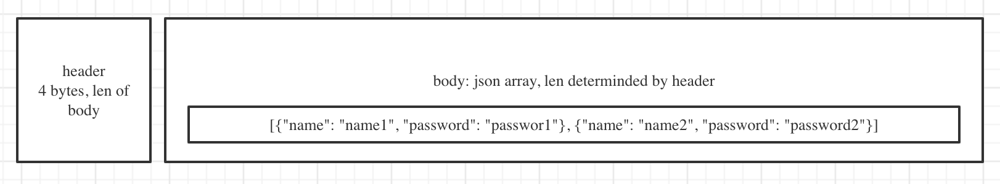

# Moon Street

A minimal user authentication implement in golang with primtive TCP and database libs.

# User Senario

If you are tasked to work on just the authentication module of a project, please read the "Quick Start" part of this document.

This Application(Server) is the central bank of the user credential, store infomations such as user name and user password, and other applications(clients) call Server via PRC, and Server will tell the clients user credential verified results.
Once clients get the result, they can do further operations suach as making a token according to the result.

# Quick Start
Before quick start, please make sure you have installed golang on your target env.

1. git clone gitlab@git.garena.com:zezhou.zheng/moon-street.git
2. cd moon-street/cmd
3. go build
4. ./cmd

This will start the port which in config/config.yml, and starting serve

There's also a client example for you to run as a test

1. cd moon-street/client
2. go build
3. ./client

# Protocol Overlook

